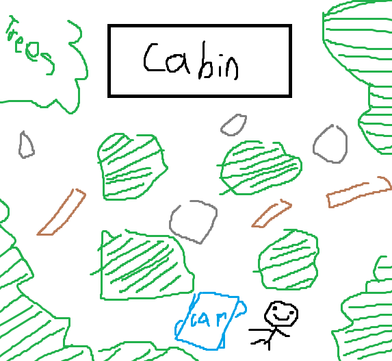

# Entry 3
##### 4/15/24
### Creating a Definitive Concept
Over the past while I have been attempting to learn UE5 and in order to start building my game I need to make a concept that is simple. What I knew I wanted to make is a first person game with a fleshed out map. After brainstorming different ideas online and even looking at past project examples I determined I wanted to make a scavenger hunt game. I felt that this should have been simple enough to be able to code, as it is taking multiple of the same type of object and attributing to a single point.

To try to make the game make some sense, I tried thinking of a senario. I wanted to figure this out before coding the game so that I would know what the object was that the player is trying to find. Eventually I came up with a "stranded senario". Imagine driving in a forest and then running out of gas. The goal of the game would be to gather gas cans and fill up the car. I picked a forest-like senario because amoungst all of the trees and other components of a forest, it would created good places to hide the cans.

I started skteching out the map from a top down look to figure out the layout. I eventually landed on a desgin that would enclose the player in a certain section of the forest and provide variety to the surroundings.

### My plan
My overall plan is to make a base map, not exactlty like the map but one that will serve its function. Then set up the player. Finally, creating a pick-up system. After I am done with those I shouldm have a minimum viable product, afterwards I will go back and flesh out the map more. I beleive this will be difficult with UE5 due to how complicated the UI is. The only way to know for sure is to attempt it. Worst case senario will be that I have to switch to Unity and see what I can do with that.

### EDP/Skills
In the engineering design process I am currently at stage 3(Brainstorming) and stage 4(Planning). I've been figuring out and fleshing out the details of the project so that I know what I have to do and how to start it. I am currently decomposing my project and organizing what I have to do. I've also had to get creative and considerate about the map because when it comes to a scavenger hunt game the map is a big part of the game.

[Previous](entry02.md) | [Next](entry04.md)

[Home](../README.md)
