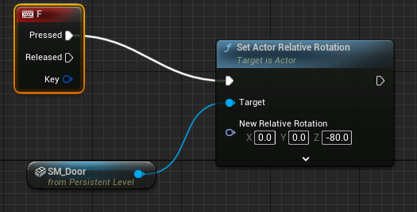
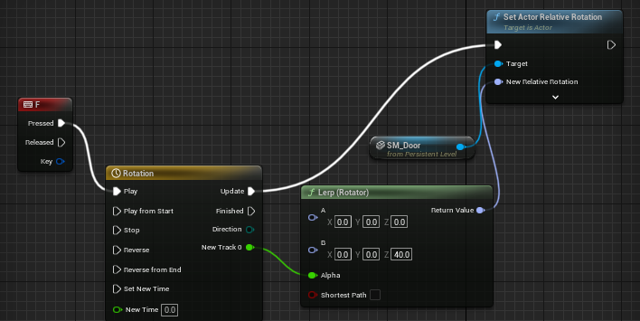
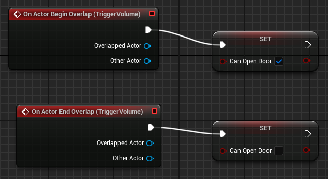
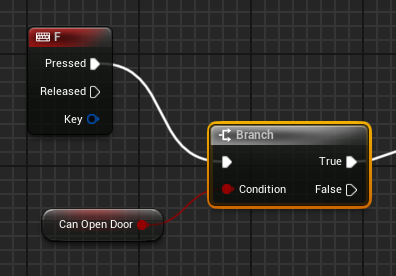

# Entry 3
##### 3/13/24

### Continuing UE
I continued with the tutorial from last time. I spent my time trying to make a functional door. To start I selected the door and opened the level blueprint. Basically the level blueprint controls the functionalities of the level. I created a reference to the door and then used what seemed like a rotation function called "Set Actor Relative Rotation" which rotates a given object. I then created a "key event" which I learned is like and if statement for if a certain key is pressed. I then connected this to the rotate block so IF the F key was pressed, THEN the door rotates.

However when I did this there were two things wrong, the first being the door had no collisions and the second being it didn't work. First I went to fix the collisions which I had to look up and I found out what to do on the [unreal website](https://docs.unrealengine.com/4.27/en-US/WorkingWithContent/Types/StaticMeshes/HowTo/SettingCollision/). Apparently it had to do with the mesh itself and I had to go open the door's mesh blueprint and edit the door. I clicked collision and was met with many options and went back to the website to see the best fit which ended up being "Add Box Simplified Collision". This added the collisions to the door so that the player could not pass through the door. I figured out that while in testing mode, if you exit unreal engine records any errors while playing. Something I noticed is that the number of errors matched the number of times I hit the F key, in other words everytime I tried to open the door. After looking at the error message I quickly realized the reason it wouldn't rotate was because the mesh was set to static which means it "remains the same". I changed this setting via selecting the mesh and selecting "moveable" instead of static. After this the door worked.

The second part of the door I worked on was making a smooth animation for the door. I made a "timeline" and found out how it worked. It is like editing a video and having the time of the video at the bottom except it is an animation. On the timeline you can set "keys" which are basically points of change in the animation. In this case it was just the begining and end of the animation and set the length to 1 second. I then added a "lerp rotation" function which was another block to make the door rotate but it was more specific with how it would be rotated. It asked for a start rotation and an end position which I put in and then passed it THROUGH into the "Set Actor Relative Rotation" block.

After this I made sure to connect all the blocks together. I connected the "key event" block to the timeline so that it would PLAY when the F key was PRESSED. Then the timeline was connected to the "lerp rotation" block to APPLY the animation time to that movement while also connecting to the "Set Actor Relative Rotation" to UPDATE it. Finally the return value of "lerp rotation" was connected and PASSED THROUGH the "Set Actor Relative Rotation" function which acted on the door. After this when I pressed F on the door it would open in a smooth motion instead of snapping to the rotation.

The door would open when pressing F but I could also do it from far away so I continued with the tutorial to see how I could make it so I could open the door only if the player is close. Before I even did it I had an idea of how it would be done, I would assign an area around the door and if the player overlapped with the area, the door could open and it would. This is actually how it worked as well. I created a trigger volume which is an invisible area I could place anywhere. Then when I went back to the blueprint I made a `boolean` variable called `canOpenDoo`r. I then added an event that registered if the player overlapped with the volume, and if so `canOpenDoor` would be set to true. Another part I had to add that I did not know I would have to do prior is add an event registering if the player STOPPED overlapping with the volume, if so `canOpenDoor` would be set to false.

After I set up the condition for opening the door, I made a branch inbetween the key event and animation event, which would act as a sort of if statement. If key F was pressed and if the door can be opened, open the door. Doing this made the door finally work as intended.

### EDP/Skills/Plans
In the engineering design process I am currently at stage 2 (Researching) because I am figuring out how to use unreal engine. During this time I have practiced skills such as learning on my own by googling and reading documentation in order to problem solve. I have also had to debugg when it came to my mesh properties. In the future I am planning on speeding up my process on learning and plan on starting my project very soon.

[Previous](entry02.md) | [Next](entry04.md)

[Home](../README.md)
