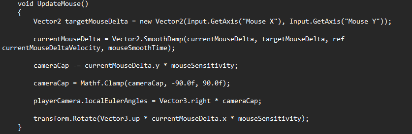

# Entry 5
##### 5/15/24
### Transition to Unity
The transition to Unity has been much easier than I've thought It would be. The UI of Unity is much simplier and much more flexable than UE5. This made the process of creating a map much easier. What also made making a map easier was the Unity asset store where there was plently of free assets to use that were easy to import. With the Unity asset store and watching many tutorials I felt prepared to start.

### Making the game
One major difference between UE5 and Unity is that UE5 projects will already have most of the player setup done for you, leaving just some positioning. However in Unity you have to not only position but you have to actually make the player along with all of the movements. This added more to what I had to do but I was willing to go through with it. I started with making a basic ground to walk on before making a capsule object for the player. Then I had to position the camera onto the new object. Following this I made a new movement script. 

The code basically moves the camera based on the players movement, and movement of their mouse. This way, the poisiton of the camera will allign with the player object AND rotate accordingly.

[Previous](entry04.md) | [Next](entry06.md)

[Home](../README.md)
