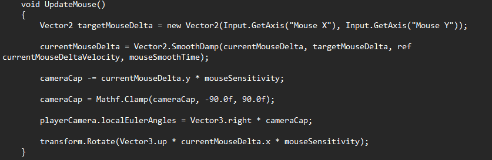
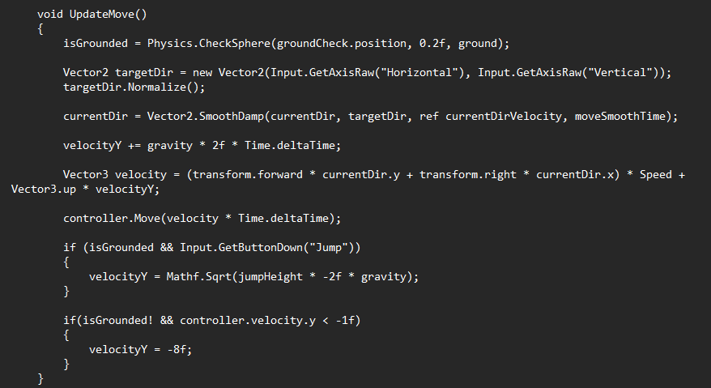
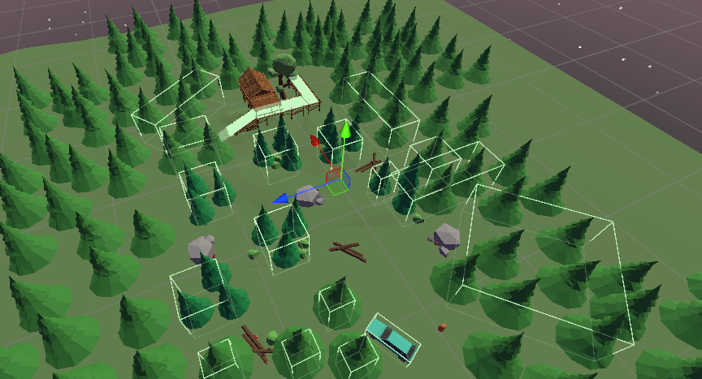
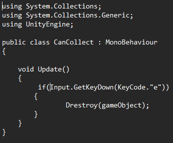

# Entry 5
##### 5/15/24
### Transition to Unity
The transition to Unity has been much easier than I've thought It would be. The UI of Unity is much simplier and much more flexable than UE5. This made the process of creating a map much easier. What also made making a map easier was the Unity asset store where there was plently of free assets to use that were easy to import. With the Unity asset store and watching many tutorials I felt prepared to start.

### Making the game
One major difference between UE5 and Unity is that UE5 projects will already have most of the player setup done for you, leaving just some positioning. However in Unity you have to not only position but you have to actually make the player along with all of the movements. This added more to what I had to do but I was willing to go through with it. I started with making a basic ground to walk on before making a capsule object for the player. Then I had to position the camera onto the new object. Following this I made a new movement script. 

The code basically moves the camera based on the players movement, and movement of their mouse. This way, the poisiton of the camera will allign with the player object AND rotate accordingly. After doing this I made a way to jump. I did this by creating a box under the player. I used this new object to check if the player was grounded.

If the player is grounded they can jump and otherwise, they can't. After I finished making a movement system I had a map with a player. I tested the movement and while it worked, the collisions for some of the setting didn't work. Most concerningly the cabin and trees had no colliders. I tried adjusting the layers of those objects and tried turning on collisions to no avail. To try to improvise I did the colliders mannually by making meshless(invisable) boxes around the parts I wanted to have colliders.

Finally, I made an attempt at the collection system. To start this I tried making an array of cans. I also put them into one group. The main goal was that when the player hits a certain key, the can object is deleted from the array and a counter goes up. I looked at [Unity's documentation on destroy functions](https://docs.unity3d.com/ScriptReference/Object.Destroy.html) and attempted that.

However this never worked. I tried different variations and different ways to figure out how to do it. Despite this, I was able to create an exceptational game for the small time I had. Adding this and extra features is what I plan in the future.

### EDP/Skills
In the engineering design process, I am at stage 5(Creation), stage 6(Testing), and stage 7(Improvements). I've been creating my project while testing and improving it along the way to make the best product I can given the time. I have been debugging and growing my knowledge as I've gone through this proecess. I've also used documentation I've read to assist me in this.

[Previous](entry04.md) | [Next](entry06.md)

[Home](../README.md)
